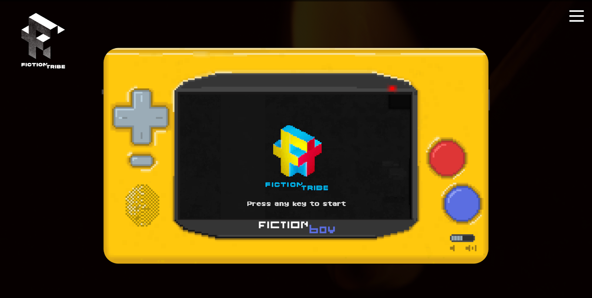
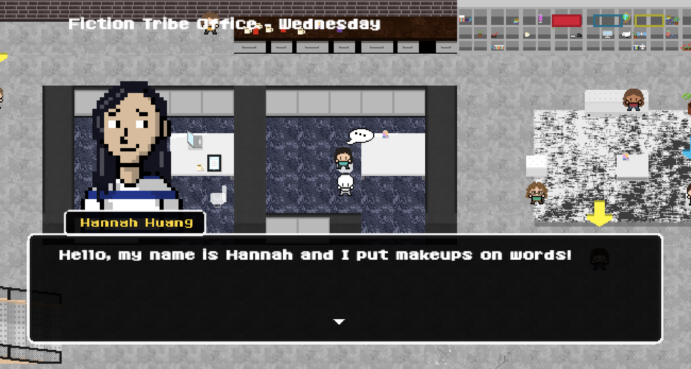
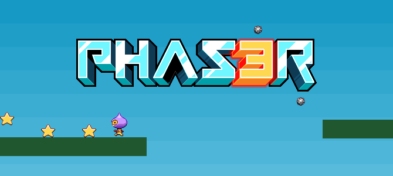
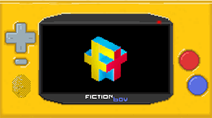

With every new project, the Fiction Tribe development team’s focus is to always create great user experiences. On a project-by-project basis, we determine the right technologies that will allow us to create performant, scalable web experiences. We love to develop unique products and approach challenging projects in different ways. There are no limits: A new project may come to us as a mobile app, landing page, an interactive web component, or even a full-fledged gaming experience. 

We recently had the opportunity to create a web-based browser game. In this game,the user can point and click to explore a virtual, retro version of our office in Portland, Oregon. Along the way, users can chat with virtual versions of Fiction Tribe staff, and play lighthearted minigames.

In this article, we will dive deeper into the concept, technology, and development process for our web game.

  </img>

### Conceptualizing the Fiction Tribe Office

The core mechanic for the Fiction Tribe Office is a “mad libs” style game. Mad libs is a game where players are presented a story with missing, “fill in the blank” words, and they must substitute the missing words. Upon beginning our web game, the system randomly selects one of several stories to be completed. The player obtains words to fill in the story’s blanks by completing minigames and speaking with in-game characters. Upon completing the three main minigames, the story is revealed to the player.

The game world is a retro, interactive version of our studio office. The NPCs (non-playable characters) are simply pixelated versions of the staff at Fiction Tribe. Each character has three words, a noun, a verb, and an adjective. As part of this fun exercise, each coworker in our office provided their own virtual character’s words.

  </img>

Interacting with Ficton Tribe Office NPCs

### Choosing Technology

Early on, we made the decision to use a game framework or engine to help develop our game. We knew we needed flexibility for development, and also wanted to save development time so we didn’t have to code every basic game system from scratch. We knew we would be developing a HTML5 game set in a 2D world as a desktop experience. This ruled out any 3D-specific frameworks such as the excellent Three.js or Unreal Engine.

In the landscape of libraries, engines, and frameworks used for HTML5 game development, three potential options stood out for us above the rest: 

* PixiJS
* Unity
* Phaser 3

As a brief overview, PixiJS is a performant WebGL (or canvas optional) rendering library for creating interactive graphics and animations. It is a streamlined library focused more on visual aspects, and it misses much of the systems one would find useful in developing a 2D game such as a game camera, tilemap support, asset loading, etc. These are systems that a developer would otherwise have to code from scratch or find additional libraries to support.

Unity is the C#-based heavy-hitting engine used for much of modern game development. Unity games are often in the 3D space—but not always. The engine also has robust support for 2D and tilemaps, as well as a very large community. For our team, downsides would include dealing with a somewhat cumbersome environment, as well as a longer ramp up period. For the scale of the game we were aiming to build, the features Unity offers didn’t seem necessary. We were also trying to stay within the JavaScript ecosystem, as it is almost universally known by web developers, and thus easier to find development support as we maintain and grow our game.

We ended up choosing Phaser 3, which is a JavaScript-based open source game framework that offers many of the aforementioned systems one would desire in 2D game development including tilemaps, asset loading, sound support, advanced input support, and scale managers. It is built on a version of PixiJS, supports WebGL, and canvas-based rendering.

  </img>

Phaser 3 HTML5 Game Framework

The project has excellent documentation, open source examples and code, and active forums for troubleshooting support. We kick-started our project with open source code to build a prototype interactive game world in an elementary structure that we could expand upon and develop as we saw fit.

We supplemented our 2D world tooling with Tiled Map Editor, a free, open source, and flexible level editor. Tiled has robust functionality and is compatible with our web game framework. A game developer can lay out a gameworld by determining a pixel size per tile and simply selecting and placing each tile, not unlike putting together small, reusable puzzle pieces.

Working from inside the browser has other benefits: We can overlay regular HTML elements. We utilized this for our final screen, in addition to building a virtual version of a portable game console with interactive buttons for moving the game character and interacting with the game world.

### Fiction Tribe Office Development

Our creative team regularly provided art assets to the Development team in the form of sprites, sprite sheets, and simple design documents to illustrate how the virtual office should be built. 

We visually built our virtual world as mentioned earlier by meticulously placing each 30x30px tiles in the Tiled Map Editor. When finished, we exported this map data for integration with Phaser. Tiled map files are exported as JSON (Javascript Object Notation) files, a simple and extremely popular data interchange format that allows the sharing of object data through a collection of key values.

  </img>

Interacting with Ficton Tribe Office NPCs

Each sprite was compiled into a texture atlas. A texture atlas is an image containing multiple smaller images (which can be of varying sizes) intelligently packed together to reduce overall size. We utilized these in Tiled, and inside Phaser they were utilized to create animations in our game world.

Each minigame, the game overworld, preloader, and overlay interface itself all are considered separate “scenes” within the Phaser 3 framework. A scene leverages object-oriented programming class structure and utilizes inheritance to extend the base Phaser Scene class. It has its own encapsulated instance of Phaser “scene level” systems. These systems include game cameras, input, sound, textures, and animations.

Phaser 3 scenes have their own life cycles, which are the stages each scene is subject to. These include stages for what happens when a new scene is first loaded (the Preload method), when the scene is launched (the Create method), and for while the Scene is running (the Update method). This allows developers to manage when assets are loaded, what happens when a scene is booted (e.g, add a player to the game world), and what continuously happens during the extent that a scene is running.

### Try it Now

We have an early version of the game’s build currently live on our studio site. The game features three minigames and a virtual office full of quirky NPCs to chat with. 

  

    
  

  

    <a class="cta-link" href="https://fictiontribe.com?game" target="_blank">Play the game <svg style="color: rgb(0, 0, 0);" xmlns="http://www.w3.org/2000/svg" width="32" height="32" fill="currentColor" class="bi bi-arrow-right" viewBox="0 0 16 16"> <path fill-rule="evenodd" d="M1 8a.5.5 0 0 1 .5-.5h11.793l-3.147-3.146a.5.5 0 0 1 .708-.708l4 4a.5.5 0 0 1 0 .708l-4 4a.5.5 0 0 1-.708-.708L13.293 8.5H1.5A.5.5 0 0 1 1 8z" fill="#000000"></path> </svg></a>
  

