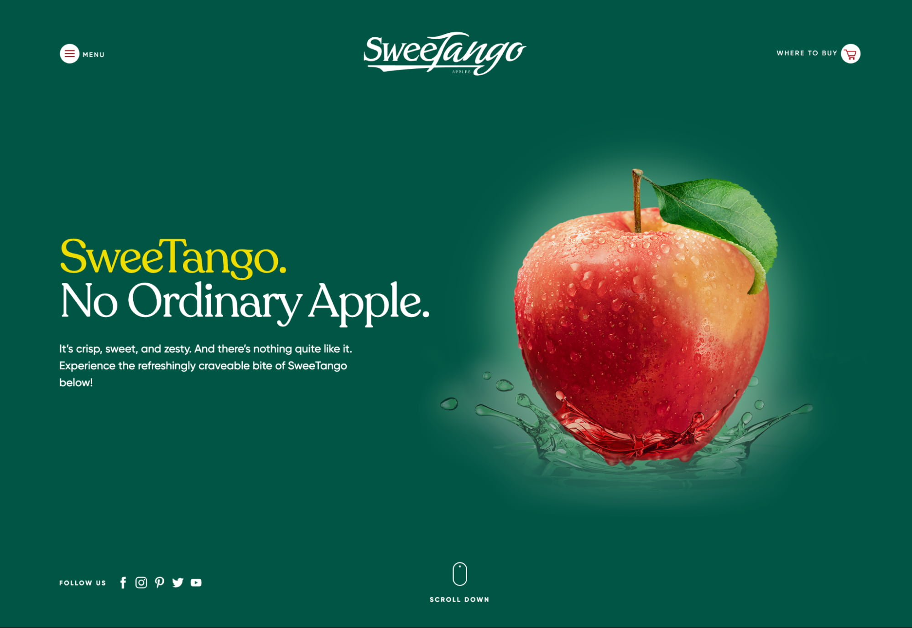

When our development team receives a request to redesign a website, or build one from scratch, a frequent first question from clients is, “What backend technology stack or CMS do we use?” Back in the day, the choice was very easy—WordPress (almost always). Now the landscape has changed, and the web software market today has much more to offer. Typical Content Management Systems (e.g. WordPress, Drupal, Craft) with self-hosted SQL databases are now competing with flat-file CMS platforms like Statamic, new-wave Static Site Generators (e.g. Gatsby, Hugo, 11ty), quite trendy headless CMS platforms (e.g. Contentful, Graph CMS, Strapi), and even drag-and-drop builders like WebFlow. 

## So, we’ve come up with a list of  four favorite approaches to building editable websites:
-   Statamic

-   WordPress

-   SSG (Static Site Generator) + Netlify CMS for easy content management

-   Headless CMS

### How do we make a choice?

As every client has different goals to achieve with their website, and different internal teams with varying levels of experience, there's never a single best CMS choice that fits all. So, our goal is to find the technology stack that will work best for the particular client, given their specific technical requirements and goals.

  

First, we complete an internal assessment of the existing website. Our analysis includes multiple parts: visual, technical breakdown, and SEO examination.

## Simply put, we are looking to answer these questions:

**Visual:**
-   How many pages does the site have?
    
-   Are the pages heavily templatized?
    
-   Are the page blades/components reused across different templates?
    
-   How much interactivity is there on the site now?
    

  

**Technical:**
-   What platform is the current site powered by?
    
-   Is the frontend decoupled from the backend?
    
-   What is the current hosting provider or server architecture?
    
-   Is there a CDN used to serve assets?
    
-   What are the site's functions?
    

-   Is there a client login?
    
-   Does the site store any client data?
    
-   Is there cart functionality?
    
-   Is there a blogs/news section on the site?
    

  

**SEO:**
-   What is the current page load speed on desktop?
    
-   What is the current page load speed on mobile?
    

-   Do those differ significantly?
    

-   What is the initial server response time?
    
-   Are there any plugins used for SEO automation?
    
-   Does the page template markup follow good semantics?
    

  

After we do our initial analysis and have answers to all of these questions, it's time to ask the client about their current experience with the site.

## These questions include, but are not limited, to the following:

-   Will the new website be built from scratch, or do you want to keep the existing base?
    
-   Are there existing issues with how the content is currently managed on the site?
    
-   Are there existing issues with the continuous development of the site?
    
-   Who is currently managing the content of the website?
    
-   Who is currently doing continuous development/adjustments on the site?
    
-   Are we able to access the existing site’s admin panel to create a data structure chart?
    
-   Where is the website hosted? Do you intend to keep the same hosting environment?
    
-   If building from scratch, do you require all content to be moved to the new site?
    
-   Will there be any third-party services integrated? If so, which ones?
    
-   Does the site receive/send any data through APIs?
    
-   Are there any integrations with your other internal products/software (remote login, data exchange, shared user accounts)?
    
-   Is there localization on the site? If yes, how many languages? How is it currently managed?
    
-   Is there any new functionality expected that is not currently part of the site?
    
-   How do you deal with form capture? Is there an existing CRM you use that has an embeddable form capture (e.g. Marketo, Hubspot, etc)?
    

  

Once all information is gathered, we analyze it to choose an optimal approach. There are several things we consider when making a choice. For instance, if we find out there's no client login functionality required, and no plan to store any secured data on the site, we may consider looking into database-less approaches (e.g. Statamic, SSG).

  

On the other hand, if the client is already using a highly efficient, managed hosting environment (e.g. WPEngine, Kinsta) and wishes to keep it, we will lean toward keeping WordPress as the CMS.

  

The answer to our question regarding localization is also very important, as the CMS choice may be highly affected based on the existing/desired localization workflow. As an example, if the client is using a translation partner that automates their workflow, WordPress may be a better choice due to the existence of multiple plugins that can assist with this functionality.

  

This just skims the surface of the considerations we take when choosing a CMS. As you can see, there are a lot of factors to assess when choosing an appropriate technology to drive the site.

  
Learn how Fiction Tribe can help you achieve your goals

  <!-- modify this form HTML and place wherever you want your form -->
  <form id="form-cta"
    action="https://formspree.io/f/moqregjy"
    method="POST"
  >
    

      

        <label>
          Name:
        </label>
        <input type="text" name="lastname">
      

      

        <label>
          Email:
        </label>
        <input type="email" name="email">
      

      <button type="submit">Submit</button>
    

    

    <!-- your other form fields go here -->
  </form>

## Now let's dive into each of our favorite tech stacks and look at their pros and cons.

  

### Statamic

Statamic is a very modern and developer-friendly Content Management System. It provides full freedom on the front end, and the backend is very customizable to easily meet client's needs. By default, Statamic comes with no database (it can be easily switched to use a SQL database, if desired). We find that many websites do not need a database at all. Let me dive deeper into why.

  

Having all website content stored within the site's filesystem makes it very easy to version control/backup the entire site with Git. In addition, there are no requests hitting the database, making the website load faster and avoiding any need for database management. It also prevents any SQL injection hacks. Think again if you can't imagine a corporate website without any database.

  

Despite being our favorite, like with any other solution, we still have a breakdown of pros and cons. Let's take a look:

  

**Pros:**
-   Highly scalable and customizable due to the underlying Laravel framework
    
-   Clean developer-driven project architecture
    
-   No database
    

-   Less security risk
    
-   Easier management
    
-   File backups have all content within them
    

-   Efficient Continuous Deployment with Git
    
-   Localization management
    
-   Less plugins to manage (decreased potential for breaking changes)
    

  

**Cons:**
-   A small plugin library (most integrations have to be done with custom code)
    
-   Not as many reputable managed hosting providers
    
-   Smaller developer community (harder/more expensive to find dev resources to offer continuous support)
    
-   No existing plugins to automate the localization workflow with a translation agency
    
**We built the new digital brand experience for Cisco Investments using Statamic.**

<a href="https://ciscoinvestments.com/" target="_blank">

  </img>

</a>

[https://www.ciscoinvestments.com/](https://www.ciscoinvestments.com/)

### WordPress

WordPress might seem like a cry from the past but that's not the case. It’s constantly updated and stands as strong competition against new-wave solutions. Gutenberg block editor has erased the need to install heavy page-builder plugins like Elementor or WPBakery. As well, you can now use WP as a fully headless CMS. It's very easy to get support or development assistance, as the freelance market is full of rather inexpensive WordPress developers.

  

**We would highly consider using WordPress when:**

-   The client's current website is built on WP, and the client has a larger editing team already familiar with WordPress
    
-   Localization is required, and there's a desire to use a translation partner to localize content
    

  

**Pros**
-   Familiar admin/content editing experience
    
-   Extensive plugin library, including multiple plugin options for managing localization and integration with translation agencies
    
-   Visual page building experience (using Gutenberg editor)
    
-   A lot of available talent for long-term support
    
-   Many fully managed hosting provider options
    
-   Can serve as a headless CMS
    

  

**Cons**
-   General heaviness
    
-   Security concerns (WordPress attracts a lot of hackers due to its popularity)
    
-   Potential pain with sync between dev environments (if any changes are introduced to the live site while working on a local environment)
    
-   A lot of maintenance (especially when using many plugins)
    
-   CI/CD pipelines not as streamlined as other CMS options, such as Statamic
    

  

**An example website running WordPress**

<a href="https://sweetango.com/" target="_blank">

  </img>

</a>

[https://sweetango.com/](https://sweetango.com/)

### Headless CMS

The headless CMS approach is a smart way to build and manage a modern website. The separation of backend and frontend can ultimately make the new website load very fast, especially if also introducing a static site generator into the equation. But even without it, we now can use a modern JS framework (like React or Vue) for the frontend portion of the site, which helps avoid page reload when moving between pages and gives full control over the website experience.

  

**To summarize, here are the pros and cons of the Headless CMS approach.**

  

**Pros:**

-   Complete control of the frontend
    
-   More focus shifts to visuals
    
-   Quite easy to set up and manage
    
-   More efficient CI/CD
    

  

**Cons:**

-   Most headless solutions are SaaS platforms that charge a hefty monthly fee for a bigger-than-a-business card website
    
-   In most cases, data is hosted within a locked third-party infrastructure.
    

  

### Static Site Generators (SSG) and Netlify (or similar)

We discovered SSGs about 3 years ago and fell in love with it during the first build of a real website, using it to edit the site and regenerate all the static HTML on changes. It seemed like magic. You get all the pros of a fully static site (lightning load speed, quick development, etc), and get most of the benefits of a CMS like WordPress (e.g. ability to edit all website content, have a full featured media/assets library, user roles, page builder functionality).

We truly believe in building websites this way. However, as with the other CMS options, this approach wouldn't work for all.

**Pros:**

-   Fully static, meaning a very fast page load speed
    
-   Easy to develop
    
-   Easy to manage/support in future
    
-   Great for smaller-scale websites
    
-   Despite using a third party to manage content, all data is stored within text files on the client side
    

**Cons:**

-   Requires a third-party solution to allow for user-friendly content editing (we love Netlify)
    
-   Based on the choice of SSG and the editing interface system, there could be some limitations to the templates and what could be managed/edited within the site (custom fields/components wouldn't be as extensive as in WordPress or Statamic, per say)
    
-   Visual editing interface might come with a monthly fee
    

As you can probably tell, it takes a lot of research to choose the right technology stack to drive a website. Our development team always spends a good chunk of time analyzing the client's current approach to determine the best solution. When doing so, we are not only thinking about how these could be improved, but also diving deep into exactly what the website needs to accomplish long-term client goals.

In a lot of cases, this involves proposing a brand new technology stack to serve as the site’s engine for years to come.

## Check out our website for more examples of the work we do on the web
<a target="_blank" href="https://fictiontribe.com/" class="glow-on-hover" type="button">fictiontribe.com</a>

