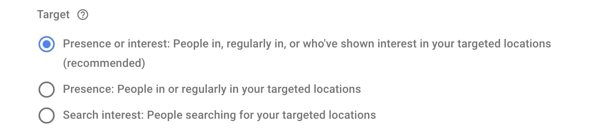
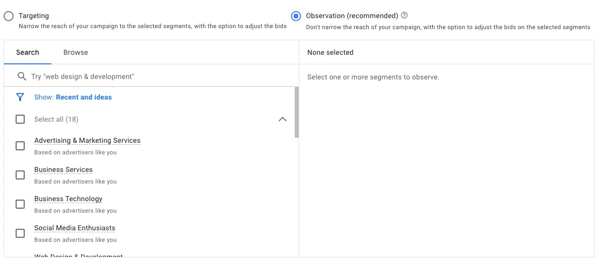

Google Ads is a powerful ad platform that can help businesses of all sizes reach their target audience. However, using the platform effectively is another matter.

Recently, we audited one company's Google Ads and found that their campaigns served more than 33% of their ads to non-relevant audiences, meaning they were throwing one-third of their budget away.

Let's explore some of the best practices and tips for optimizing your Google Ads campaigns by looking at some often-overlooked settings and metrics that could cost you money.

### 1) Google Location Settings

Consider the options available under the "Location" tab when setting up geotargeting in your Google Ads campaign. 

You can target people currently located in or regularly in your targeted locations (Presence), those who have shown search interest in your targeted locations (Interest), or both. 

By default, Google will select Presence AND Interest, which may not be the best choice for your business.

<a style="cursor: initial;pointer-events: none;" class="cta-link" href="" target="_blank">
  </img></a>

For example, targeting people who regularly visit your city may drive extra bookings if you run a hotel. 

On the other hand, if you're a local service like an auto body shop, you wouldn't want non-residents seeing your ads. 

In the case of a company running a North American campaign, presence AND interest targeting resulted in 7% of traffic outside the target region the product is offered. A simple change in location targeting stopped 7% of the budget going to the wrong audience.  

It's essential to consider your business goals and audience when configuring the geotargeting setup to ensure your ads reach the right people and locations you want to target.

### 2) Audience Targeting

When choosing your target audience, Google Ads offers two options, Observation and Targeting. Observation is the default setting.

<a style="cursor: initial;pointer-events: none;" class="cta-link" href="" target="_blank">
  </img>
  </a>

Under Observation, Google can target outside of your target audience. There are a couple of reasons you may want to use this option:
 You don't know enough about your customer and learn what Google audiences perform well.
Your target audience is large enough that you're willing to let Google optimize your audience.

If these aren't you, this default option could hurt your campaign performance. 

In our example case, the target audience was middle management IT professionals at companies with 500+ employees. 32% of their spend fell outside of these parameters because they were using Observation targeting. 

### 3) Quality Score

The introduction of responsive ads as the default search ad unit has made maintaining a high Quality Score difficult. 

In our example, 49% of keywords had a below-average Quality Score resulting in throttled traffic and higher CPCs. 

**There are a couple of steps we recommend to boost the overall quality score of the ads:**

* Trim your keywords down to those that perform well and be more purposeful in reintroducing new keywords. 
* Thematically group keywords in fewer ad sets to allow for landing page and copy customizations to make your ads more relevant.
* Instead of placing all keyword types together, implement an alpha-beta structure. Alpha campaigns should include high-performing exact-match keywords that you continuously expand based on new phrase-match search terms. 
* Ensure all of your responsive ad's strengths are rated as excellent.  

<a style="cursor: initial;pointer-events: none;" class="cta-link" href="" target="_blank">
  </img>
  </a>

With these simple changes, our client was able to eliminate wasteful spend that accounted for over 1/3rd of their budget, driving down their CPAs and improving the overall lead quality. 

As an advertiser, it's essential to consider the impact of how your ads are configured on your campaign's effectiveness.  

Even simple audience and location settings could result in over 1/3rd of your budget targeting the wrong audience.

By understanding how these settings work and optimizing with metrics like quality score, you can create more effective ads and campaigns to hit your marketing goals.

  
Learn how Fiction Tribe can help you achieve your goals

  <!-- modify this form HTML and place wherever you want your form -->
  <form id="form-cta"
    action="https://formspree.io/f/moqregjy"
    method="POST"
  >
    

      

        <label>
          Name:
        </label>
        <input type="text" name="lastname">
      

      

        <label>
          Email:
        </label>
        <input type="email" name="email">
      

      <button type="submit">Submit</button>
    

    

    <!-- your other form fields go here -->
  </form>

